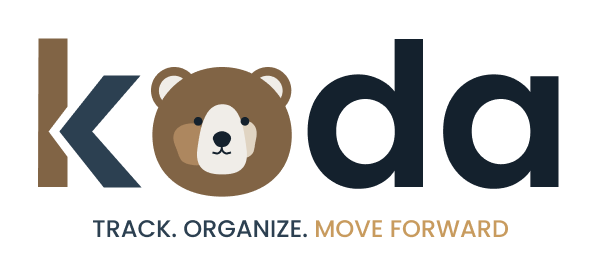

# Koda

<p align="center">
  
</p>

<p align="center">
  <strong>A focused workspace for managing job applications.</strong><br>
  Add. Track. Remember.
</p>

<p align="center">
  
  
  
</p>

---

## Overview

**Koda** is a personal job application tracker designed to make the application process easier to remember and manage.

Instead of acting as a job-search marketplace or an AI assistant, Koda focuses on one practical workflow:

> **Add → Track → Remember**

Users can record an application, follow its progress, keep relevant details in one place, and manage the next actions connected to that application.

## Core Features

- **Application tracking**
  - Company
  - Position
  - Location / work setup
  - Date applied
  - Application status
  - Where the application was submitted
  - Job posting link
  - Salary expectation
  - Contact information
  - Notes

- **Application lifecycle**
  - Applied
  - Screening
  - Interview
  - Offer
  - Rejected
  - Withdrawn

- **Application-specific tasks**
  - Add tasks
  - Set due dates
  - Add notes
  - View task details
  - Edit tasks
  - Delete tasks
  - Mark tasks complete

- **Dashboard**
  - Application overview
  - Interview count
  - Open tasks
  - Recent applications
  - Next actions

- **Search and filtering**
  - Search applications
  - Filter by status

- **Local-first persistence**
  - Application and task records are stored locally on the device.
  - Koda does not require an account for its core tracking workflow.

- **Native date selection**
  - Application and task dates use the platform date picker on supported mobile platforms.

## Design Philosophy

Koda intentionally avoids the common "generic SaaS dashboard" pattern.

The interface uses an **editorial, calm, career-workspace aesthetic** built around:

- Clear hierarchy over decorative UI
- Generous but controlled whitespace
- Short visual paths to the next action
- Subtle motion instead of attention-grabbing animation
- Restrained use of color
- Application progress represented as a journey
- Consistent typography and spacing
- Accessible interaction targets and clear states

The design principle behind the product is:

> **Show the user what matters now, not everything the system knows.**

## Brand & Visual Design

### Logo

The primary Koda logo is stored at:

`assets/images/koda-logo.png`

The launcher/app icon is stored at:

`assets/images/icon.png`

### Color Palette

| Role | Hex |
| --- | --- |
| Deep Navy | `#14212D` |
| Slate | `#2C4051` |
| Warm Brown | `#816445` |
| Gold Accent | `#C89B5E` |
| Warm Neutral | `#E0D4C2` |
| White | `#FFFFFF` |

The palette combines dark blue-gray foundations with warm brown/gold accents to create a professional but less corporate visual identity.

### Typography

Koda uses **Poppins** for its interface typography.

Weights are used intentionally:

- Regular — body copy
- Medium — supporting information
- SemiBold — labels and controls
- Bold — primary headings
- ExtraBold — high-priority display text

## UX Principles

### 1. Progressive disclosure

The application form starts with the information needed to create a useful record. Additional details remain available without overwhelming the initial interaction.

### 2. Contextual tasks

Tasks belong to an application rather than existing as an unrelated productivity list. This keeps follow-ups and preparation connected to the opportunity they support.

### 3. Next-action orientation

The dashboard and application details prioritize actions that require attention instead of treating every piece of data equally.

### 4. Low-noise interaction

Animations are intentionally restrained. Motion provides feedback and continuity rather than becoming the focus of the interface.

### 5. Consistent visual language

Primary actions, secondary actions, status information, forms, and detail views use consistent hierarchy so users can learn the interface quickly.

## Application Architecture

```text
Koda
├── Expo Router
├── React Native
├── TypeScript
├── Poppins
├── AsyncStorage
├── React Native DateTimePicker
└── Expo Navigation Bar
```

### Main routes

```text
Dashboard
Applications
Settings

Add Application
Application Details
Edit Application
```

### Data flow

```text
User action
    ↓
Applications Context
    ↓
Application / Task state
    ↓
AsyncStorage
    ↓
Dashboard + Applications + Details
```

## Getting Started

### Requirements

- Node.js
- npm
- Expo-compatible development environment
- Android device/emulator or iOS device/simulator

### Install

```bash
npm install
```

### Run the development server

```bash
npx expo start
```

For web:

```bash
npx expo start --web
```

For a cache-cleared start:

```bash
npx expo start -c
```

## Android APK

Koda is configured for EAS Build.

Build an installable Android APK with:

```bash
npx eas-cli@latest build --platform android --profile preview
```

The `preview` profile is configured for an APK suitable for direct installation on an Android device.

## Project Structure

```text
Koda/
├── assets/
│   └── images/
│       ├── icon.png
│       └── koda-logo.png
├── src/
│   ├── app/
│   │   ├── _layout.tsx
│   │   ├── index.tsx
│   │   ├── applications.tsx
│   │   ├── add-application.tsx
│   │   └── application/
│   │       ├── [id].tsx
│   │       └── edit/
│   │           └── [id].tsx
│   ├── components/
│   └── context/
├── app.json
├── eas.json
└── package.json
```

## Data & Privacy

Koda's current core workflow is **local-first**. Application and task information is kept in local device storage.

No authentication or cloud account is required for the core tracker.

Future cloud synchronization, if introduced, should be treated as a separate capability with explicit privacy and data-storage decisions.

## Roadmap

Potential future improvements include:

- Cloud synchronization
- Cross-device data access
- Company logo support
- Richer sorting and filtering
- Calendar integration
- Notifications for due tasks
- Export/import of application data
- Backup and restore
- Production distribution through app stores

## Status

Koda is an actively developed project. The current version focuses on the core experience of recording applications, tracking their progress, and remembering the actions that matter.

## License

This project is currently maintained as a private/project repository. Add an open-source license only if the project is intentionally released for public reuse.
